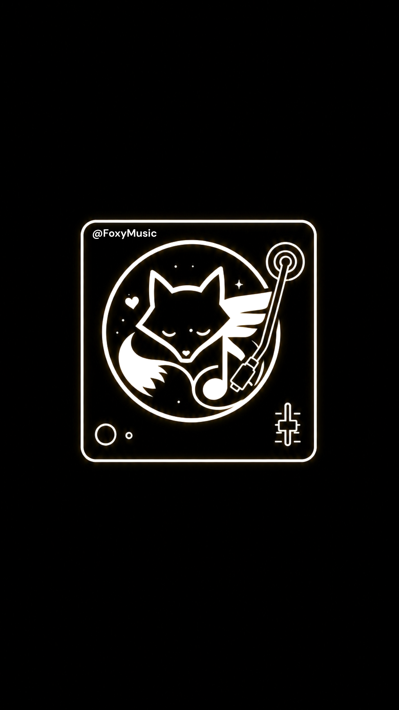

<div align="center">


# FoxyMusic

### A beautiful YouTube Music client for Android

<br/>

[](https://github.com/sparkn2008-del/FoxyMusic/releases)
[](LICENSE)
[](https://github.com/sparkn2008-del/FoxyMusic)
[](https://kotlinlang.org/)
[](https://flutter.dev/)

<br/>

[**Download**](#download) · [**Features**](#features) · [**Build**](#build-from-source) · [**Docs**](#documentation) · [**Changelog**](#changelog)

</div>

> [!WARNING]
> **Regional restriction** — If YouTube Music is unavailable in your country, FoxyMusic needs a **VPN or proxy** pointed at a supported region. This app streams from YouTube Music endpoints; it is not a standalone music host.

> [!NOTE]
> **Hybrid architecture** — Kotlin + Media3 powers playback, downloads, and notifications. Flutter renders the full UI. Best of both worlds: native reliability, expressive interface.

---

<div align="center">

## Screenshots

*Add your device captures to `fastlane/metadata/android/en-US/images/screenshots/` — home, search, player, lyrics, and library look great in the README.*

<br/>



</div>

---

<div align="center">

## Features

<table>
  <tr>
    <td width="50%" valign="top">

#### Playback
- Stream songs & videos from YouTube Music
- Background playback with Media3 / ExoPlayer
- Queue, shuffle, repeat, and **radio** tails
- Crossfade, volume normalization, skip silence
- SponsorBlock auto-skip
- Sleep timer

</td>
    <td width="50%" valign="top">

#### Audio & quality
- Stream quality presets, including **Ultra** for 320kbps+ / best available paths
- SoundCloud-first routing option for richer playback
- System equalizer shortcut
- Downloads plus local library import for songs and folders

</td>
  </tr>
  <tr>
    <td width="50%" valign="top">

#### Lyrics & discovery
- Synced lyrics (LRCLIB + YouTube captions)
- Romanized lyric display
- Compact lyrics preview on the player
- Full-screen lyrics tab with live sync
- **Music recognition** (mic → identify track)
- Recognition history

</td>
    <td width="50%" valign="top">

#### Library & account
- Liked songs, playlists, play history
- Local & synced playlists
- Offline downloads with storage stats
- YouTube Music account sign-in
- Backup / restore helpers

</td>
  </tr>
  <tr>
    <td width="50%" valign="top">

#### Home & search
- Fast personalized Home with staged shelves and skeleton loading
- Signed-in Home starts with Quick picks, then New releases
- Moods, genres, charts, categories, downloads, radio, and history drill-ins
- Rich mixed search across songs, videos, albums, artists, and playlists
- Artist pages with artist-made songs and queue playback

</td>
    <td width="50%" valign="top">

#### Interface
- Metrolist-inspired now playing sheet
- Frosted-glass chrome & AMOLED-friendly dark theme
- Dynamic accent colors from artwork
- Animated splash, mini-player styles, and bottom navigation styles
- Remote config for small Home/feed/feature tuning without reinstall
- In-app GitHub update checks + notifications

</td>
  </tr>
</table>

</div>

---

<div align="center">

## Download

### Stable release

| GitHub Releases | Recommended ABI |
|-----------------|-----------------|
| [**Download latest APK**](https://github.com/sparkn2008-del/FoxyMusic/releases/latest) | **`arm64-v8a`** for most phones |
| [All release assets](https://github.com/sparkn2008-del/FoxyMusic/releases) | **`armeabi-v7a`** for older 32-bit devices |

<br/>

**Current version:** `1.3.1` (versionCode `8`)

</div>

---

## Build from source

**Requirements:** JDK 17+, Android SDK (API 34+), Flutter SDK (embedded module at repo root).

```powershell
# Debug APK (per-ABI splits)
.\gradlew.bat assembleDebug

# Release APK
.\gradlew.bat assembleRelease

# Play bundle
.\gradlew.bat bundleRelease
```

| Output | Path |
|--------|------|
| Debug APKs | `app\build\outputs\apk\debug\` |
| Release APKs | `app\build\outputs\apk\release\` |
| App bundle | `app\build\outputs\bundle\release\app-release.aab` |

Release signing uses `key.properties` when present; copy `key.properties.example` and add your keystore paths. Without it, release builds may fall back to debug signing.

```powershell
# Optional — analyze Dart UI
flutter analyze lib/
```

---

## Project layout

| Path | Role |
|------|------|
| `app/` | Android module — player, bridge, downloads, recognition, updater |
| `lib/` | Flutter UI — `main.dart`, split now playing sheet, splash |
| `assets/images/` | Branding, splash frames, home art |
| `gradle/` + `gradlew.bat` | Gradle wrapper |
| `changelog.txt` | User-facing release notes |
| `FOXYMUSIC_INSTRUCTIONS.txt` | Maintainer blueprint |
| `foxy_remote_config.json` | Remote-config defaults served from repo root |
| `docs/README.md` | Extended architecture notes |

---

## Architecture

```
┌─────────────────────────────────────────┐
│           Flutter UI (lib/)             │
│  Home · Search · Library · Player       │
└─────────────────┬───────────────────────┘
                  │ MethodChannel  foxy_music/methods
                  │ EventChannel   foxy_music/events
┌─────────────────▼───────────────────────┐
│     FoxyFlutterBridge.kt (Kotlin)       │
│  Player · Library · Settings · Updates  │
└─────────────────┬───────────────────────┘
                  │
┌─────────────────▼───────────────────────┐
│  MusicPlayer · Media3 · Downloads       │
│  YTMusicApi · Lyrics · Recognition      │
└─────────────────────────────────────────┘
```

Bridge contracts, method names, and event payloads → **`FOXYMUSIC_INSTRUCTIONS.txt`**.

---

## Documentation

| File | Contents |
|------|----------|
| [FOXYMUSIC_INSTRUCTIONS.txt](FOXYMUSIC_INSTRUCTIONS.txt) | Build, bridge API, updater, maintainer workflow |
| [docs/README.md](docs/README.md) | Architecture deep-dive |
| [changelog.txt](changelog.txt) | Version history |

---

## License

FoxyMusic is licensed under the **GNU General Public License v3.0**.
See [LICENSE](LICENSE) for the full license text.

---

## FAQ

**Does FoxyMusic need YouTube Premium?**  
No for basic streaming in supported regions — it uses the same class of endpoints as other YT Music clients. Premium-only content may still be restricted by YouTube.

**Why Flutter + Kotlin?**  
Kotlin keeps playback rock-solid (Media3, foreground service, downloads). Flutter makes rich scrolling UI and player sheets faster to iterate.

**Where do I change the home feed order?**  
For small live tuning, update `foxy_remote_config.json` on GitHub. For code-level feed changes, edit `FoxyFlutterBridge.kt`, `YTMusicApi.kt`, and `_homeSectionLayout()` in `lib/main.dart`.

**How do updates work?**  
The app compares `versionName` to GitHub `releases/latest`, auto-checks every ~24h, and can notify once per new tag. Manual check lives in Settings.

**MIUI install blocked?**  
Enable **Install via USB** (or disable MIUI optimization) when sideloading debug/release APKs over ADB.

---

## Contributing

1. **Flutter UI** → `lib/` (especially `lib/main.dart`)
2. **Native / player / bridge** → `app/src/main/java/com/foxymusic/`
3. New bridge APIs → `FoxyFlutterChannels.kt` + `FoxyFlutterBridge.kt` + Dart `MethodChannel` calls
4. Update `changelog.txt` and `FOXYMUSIC_INSTRUCTIONS.txt` for user-visible changes

Do not commit `build/`, signing keys, Gradle caches, or reference trees (`ArchiveTune-main/`, etc.) — see `.gitignore`.

---

<div align="center">

## Special thanks

FoxyMusic draws inspiration and patterns from the open-source music client ecosystem:

| Project | Influence |
|---------|-----------|
| [**Metrolist**](https://github.com/MetrolistGroup/Metrolist) | Player UX, polished README spirit, glass-forward design |
| [**InnerTune**](https://github.com/z-huang/InnerTune) / [**OuterTune**](https://github.com/DD3Boh/OuterTune) | YT Music client foundations |
| [**SimpMusic**](https://github.com/SimpMusic/SimpMusic) | Updater flow reference |

Thank you to every library, API, and contributor that makes independent music clients possible.

</div>

---

<div align="center">

## Disclaimer

This project is **not affiliated with, endorsed by, or sponsored by** YouTube, Google LLC, or any of their subsidiaries.

All trademarks and service marks belong to their respective owners. FoxyMusic is an independent client built on publicly reachable endpoints.

<br/>

**Made with ❤️ by Foxy-Nish** ([@sparkn2008-del](https://github.com/sparkn2008-del))

</div>
